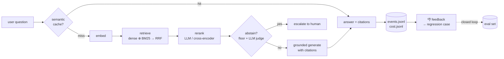

# Support-Deflection Assistant

> **Evaluation-driven retrieval engineering.** A grounded RAG support assistant
> over a curated subset of Stripe documentation that **refuses to answer** when
> the corpus doesn't actually contain the answer — measured against a 114-case
> categorized eval set with a multi-config benchmark, threshold sweeps, and
> per-category failure analysis. The point of the project isn't the architecture;
> it's that every retrieval and abstention choice has a measured tradeoff behind it.



## 📊 Benchmark — 114 cases, 4 configs

Run via `support-assistant compare`. **Numbers below are produced by an actual
run, not estimated.**

<!-- BENCHMARK_TABLE_START -->
> _Benchmark currently running in background — table will be filled when complete._
<!-- BENCHMARK_TABLE_END -->

**The one-line headline** _(populated once the run finishes)_: `<run>`

Per-category breakdown and failure analysis: see [`data/eval_reports/`](./data/eval_reports/)
after running the compare. Threshold-sweep curve: `support-assistant eval --sweep-abstain`.

## 🎥 Demo

> _Add a 30-second screen capture once you've run the system end-to-end:_
> 1. in-scope question → answered with citations, sub-second cache hit on re-ask
> 2. out-of-scope question (e.g. "How do I bake sourdough?") → **abstains**, escalation message
> 3. /dashboard tab → live KPI cards + stage-level latency breakdown
>
> Save as `docs/demo.gif` and replace this block with ``.

## ✨ Key features

- **Two-gate abstention** — dense-cosine floor + LLM judge. Threshold picked from a precision/recall sweep, not a config default.
- **Hybrid retrieval** — dense + BM25 fused with Reciprocal Rank Fusion. Toggleable for A/B.
- **Reranker A/B** — LLM reranker (free deps, slower, $) vs cross-encoder (local, fast, heavy install). Pick whichever wins your eval.
- **114-case categorized eval set** — 7 categories: `direct_retrieval`, `exact_api`, `multi_hop`, `ambiguous`, `adversarial`, `stale_conflicting`, `out_of_domain`. Per-category metrics.
- **Multi-config benchmark runner** — `compare` runs N presets and emits a markdown table.
- **Failure analyzer** — `analyze` writes a `_failures.md` with the cases the strongest config still gets wrong, grouped by category.
- **Closed feedback loop** — 👍/👎 on the chat UI writes to `feedback.jsonl`, which `load_eval_set()` ingests as regression cases on the next eval run.
- **6-page production UI** — chat, dashboard (Chart.js), sources, eval reports, feedback inbox, live runtime tuning. Server-rendered Jinja + vanilla JS, light/dark, keyboard-shortcuts modal.
- **Operational extras** — content-hash delta ingest (re-runs do zero embedding on unchanged corpus), Prefect 3 flow, structlog JSONL event log, per-call cost accounting, in-process semantic cache.

---

## Status

**Pre-launch.** Built, 60 tests passing. The benchmark table above is being filled
by a live run. Once populated, this repo crosses from *"architecture writeup"* to
*"evaluation-driven retrieval engineering with measured tradeoffs"*.

## Quick start

```powershell
# 1. setup
uv venv
.\.venv\Scripts\Activate.ps1
uv pip install -e ".[dev]"
# optional heavy local cross-encoder (~1 GB torch + transformers)
uv pip install -e ".[crossencoder]"
Copy-Item .env.example .env
# put your OPENAI_API_KEY in .env

# 2. build the index (one-time; deltas after that)
support-assistant ingest

# 3. ask a question
support-assistant ask "How do I issue a partial refund?"

# 4. THE BENCHMARK
support-assistant compare --presets baseline-dense,dense+llm-rerank,hybrid,hybrid+llm-rerank
support-assistant compare --list                  # see all presets
support-assistant compare --no-judge --limit 30   # fast smoke

# 5. failure analysis on a specific report
support-assistant analyze 1779000000_compare-baseline-dense.json

# 6. abstention threshold sweep
support-assistant eval --sweep-abstain

# 7. the UI
support-assistant serve
#   /chat /dashboard /sources /eval /feedback /settings
```

---

## System architecture (deep-dive)

Three pipelines.

### 1. Ingest pipeline (offline)

Run once, then incrementally. Re-runs on an unchanged corpus do **zero**
embedding calls.

```
  Stripe documentation  (curated reproducible subset)
        │
        ▼
   ingest.py        polite httpx · BS4 clean · drop-log · tenacity retries
        │
        ▼
   chunk.py         1000-char / 200-overlap   (placeholder, eval revisits)
        │
        ▼
   delta.py         SHA-256 hash of each chunk → diff vs last run
        │
        ├──────────────────────┐
        ▼                      ▼
   embed.py               bm25.py            ← only Δ chunks re-embed;
   OpenAIEmbedder         rank_bm25            BM25 always rebuilds (cheap)
        │                      │
        ▼                      ▼
   Chroma collection      data/bm25_index.json
   (dense, persistent)    (sparse, JSON)
```

### 2. Runtime retrieval pipeline (per question)

```
   user question
        │
        ▼
   ① cache.py        cosine ≥ 0.97 vs recent? ──▶ HIT: return cached payload
        │ miss
        ▼
   ② embed.py        question → vector
        │
        ▼
   ③ retrieve.py     dense top_k        ┐
                                        ├──▶ rrf_fuse(k=60)  if hybrid mode
                     bm25 top_k         ┘    (else dense-only)
        │
        ▼
   ④ rerank.py       none  |  LLM judge  |  cross-encoder       → top_n=5
        │
        ▼
   ⑤ abstain.py      gate A: top dense cosine < min_score?
                     gate B: LLM judge "do these answer the question?"
        │                       │
        │ pass                  │ either fires
        ▼                       ▼
   ⑥ generate.py             ESCALATE
      grounded prompt        "I don't have a confident answer…"
      [1][2] citations
        │                       │
        └──────────┬────────────┘
                   ▼
   ⑦ observability.py + cost.py
      → data/events.jsonl     (per-stage latency)
      → data/cost.jsonl       (per-OpenAI-call USD)
                   │
                   ▼
        { answer, abstained, citations, timings, cost }
```

### 3. Evaluation pipeline

The spine. The whole project is defensible because this pipeline exists.

```
   eval/data/seed_questions.json
   114 cases · 7 categories
   (direct · exact_api · multi_hop · ambiguous · adversarial · stale · OOD)
        │
        ▼
   ┌────┴────────────────────────┬───────────────────────────────┐
   ▼                             ▼                               ▼
   run_eval(config)         run_compare(presets)         sweep_abstention()
   one config × all cases   N configs × all cases        floor × N thresholds
   ▼                             ▼                               ▼
   metrics.py:  recall@k · abstain precision/recall · faithfulness · p50/p95 · $/q
   judge.py:    FaithfulnessJudge (LLM-graded groundedness)
        │                             │                               │
        ▼                             ▼                               ▼
   data/eval_reports/           …_compare.json + .md           …_sweep.json
        *.json                  ← benchmark table              ← prec/rec curve
        │
        ▼
   analyze.py
   per-category failures: false abstain · missed abstain · low recall · low faith
        │
        ▼
   …_failures.md     ← the artifact you read aloud in interview
```

Closed loop: 👎 in chat UI → `data/feedback.jsonl` → next `load_eval_set()` ingests it as a regression case.

---

## Module map

| Module | Layer | Role |
|---|---|---|
| [ingest.py](src/support_assistant/ingest.py) | data | Polite crawl of curated Stripe URL list, BS4 cleaning, drop-log, retries |
| [chunk.py](src/support_assistant/chunk.py) | data | 1000/200 fixed-size chunker (placeholder pending eval) |
| [delta.py](src/support_assistant/delta.py) | data | SHA-256 chunk hashing for incremental re-embed |
| [embed.py](src/support_assistant/embed.py) | data | OpenAI embeddings behind `Embedder` Protocol |
| [store.py](src/support_assistant/store.py) | data | Chroma persistent client wrapper |
| [bm25.py](src/support_assistant/bm25.py) | data | `rank_bm25` sparse index, JSON-persisted |
| [retrieve.py](src/support_assistant/retrieve.py) | retrieval | Dense + BM25 + RRF fusion, returns top_dense_score for abstention |
| [rerank.py](src/support_assistant/rerank.py) | retrieval | `LLMReranker` and `CrossEncoderReranker` (optional dep) |
| [abstain.py](src/support_assistant/abstain.py) | safety | Two-gate: dense-cosine floor + LLM judge |
| [generate.py](src/support_assistant/generate.py) | answer | Grounded OpenAI generation with `[1][2]` citation markers |
| [cache.py](src/support_assistant/cache.py) | optimization | In-process semantic cache (cosine ≥ 0.97) |
| [feedback.py](src/support_assistant/feedback.py) | closed-loop | 👍/👎 → `data/feedback.jsonl` → next eval as regression case |
| [pipeline.py](src/support_assistant/pipeline.py) | glue | The single `ask()` function the CLI + API both call |
| [observability.py](src/support_assistant/observability.py) | ops | Structlog + per-call JSONL event log |
| [cost.py](src/support_assistant/cost.py) | ops | Per-OpenAI-call USD accounting |
| [eval/dataset.py](src/support_assistant/eval/dataset.py) | eval | 114-case loader, auto-ingests flagged feedback |
| [eval/metrics.py](src/support_assistant/eval/metrics.py) | eval | recall@k, abstention counts, percentile, per-category bucket |
| [eval/judge.py](src/support_assistant/eval/judge.py) | eval | LLM-judged faithfulness |
| [eval/runner.py](src/support_assistant/eval/runner.py) | eval | `run_eval`, `sweep_abstention`, `run_compare` |
| [eval/analyze.py](src/support_assistant/eval/analyze.py) | eval | Per-category failure analysis → `_failures.md` |
| [api/](src/support_assistant/api/) | UI | FastAPI app + 6 pages |
| [flows/ingest_flow.py](flows/ingest_flow.py) | ops | Prefect 3 orchestration with retries |
| [cli.py](src/support_assistant/cli.py) | UI | `ingest · ask · eval · compare · analyze · serve` |

## Eval set composition (114 cases)

| Category | Count | What it tests |
|---|---:|---|
| `direct_retrieval` | 30 | Single source, clearly answered in one chunk — the baseline |
| `exact_api` | 22 | Specific endpoint / parameter / error / test-card lookup — where BM25 should help |
| `multi_hop` | 15 | Answer requires fusing 2+ source chunks — tests top_k and rerank |
| `ambiguous` | 12 | Vague phrasing — tests prompt grounding |
| `adversarial` | 12 | Lexically similar to corpus but off-topic — tests the abstention judge |
| `stale_conflicting` | 5 | Pricing / API-version — tests refusal to invent numbers |
| `out_of_domain` | 18 | Completely off-topic — tests the score floor |

## Tests

```powershell
pytest -q     # 60 passing
```

| File | What it covers |
|---|---|
| `tests/test_chunk.py` | Chunking math (overlap boundaries, IDs, order) |
| `tests/test_metrics.py` | Recall@k, abstention counts, percentile interpolation |
| `tests/test_abstain.py` | Two-gate logic + `top_score_override` for hybrid mode |
| `tests/test_delta.py` | Content-hash delta detection (add / change / remove) |
| `tests/test_cache.py` | Semantic cache hits, TTL, threshold |
| `tests/test_api.py` | FastAPI contract: `/api/ask`, `/api/feedback`, validation |
| `tests/test_bm25.py` | Tokenizer behavior, persistence, query ranking |
| `tests/test_hybrid.py` | RRF math (rank-summed reciprocals, dedup, metadata) |
| `tests/test_eval_categories.py` | ≥100 cases, valid categories, no out-of-corpus URLs, unique IDs |
| `tests/test_compare.py` | Preset application + markdown table generation |

## Known weaknesses

- **Eval set is 114 hand-written cases.** A grade-A eval pulls real questions from Stack Overflow and the Stripe community forum. The closed feedback loop is the growth path.
- **Faithfulness judge re-uses the generator's model family.** Stronger setup uses a different model for judging — one-line change in [eval/judge.py](src/support_assistant/eval/judge.py).
- **Per-event cost is approximated.** `cost.jsonl` rows aren't linked to event IDs; concurrent calls would interleave. Fine for single-user demo; real fix: thread `event_id` through `cost.record`.
- **Curated documentation subset, not a full crawler.** Reproducibility from the repo vs. surface area. M5 hardens this with a proper crawler + incremental schedule.
- **Cross-encoder is gated behind an optional install.** Default install is small; only users running the cross-encoder benchmark pull in torch.
- **BM25 tokenizer is deliberately simple (no stemming).** Biased toward exact identifier match — well-suited to technical docs full of `payment_intents`, `4242 4242…`, might not generalize to prose-heavy corpora without re-tuning.

## Tech stack

`Python 3.12` · `OpenAI` (gpt-4o-mini + text-embedding-3-small) · `Chroma` (local persistent)
· `rank-bm25` · `sentence-transformers` (optional, cross-encoder reranker) · `FastAPI` +
`Jinja` + vanilla JS + `Chart.js` · `Prefect 3` (orchestration) · `pytest` (60 tests) ·
`structlog` (JSON event logs) · `tenacity` (retries) · `pydantic-settings` (env config)

The project intentionally uses lightweight abstractions to keep retrieval and
evaluation behavior explicit and debuggable — the eval harness is the source of
truth for every choice, and the modules above are thin enough to step through in
a debugger or read aloud in a code review.

---

## Publish checklist

**Repo description** (paste into GitHub "About"):

> Evaluation-driven RAG support assistant over a curated Stripe documentation subset. Two-gate abstention, hybrid retrieval (BM25 + dense + RRF), cross-encoder vs LLM reranker A/B, 114-case categorized eval harness with per-category metrics, threshold sweeps, and failure analysis.

**Repo topics:**

```
rag retrieval-augmented-generation llm abstention hallucination
evaluation hybrid-retrieval bm25 reranking fastapi openai
chromadb prefect ai-engineering
```

**Pre-publish:**
- [ ] Benchmark table populated with real numbers from `support-assistant compare`
- [ ] One failure case picked from `_failures.md` to talk about in the LinkedIn post
- [ ] 30-sec screen recording saved as `docs/demo.gif`
- [ ] `LICENSE` file (MIT)
- [ ] `git init && git push`, set the About / Topics fields above, pin to profile

## License

MIT.
